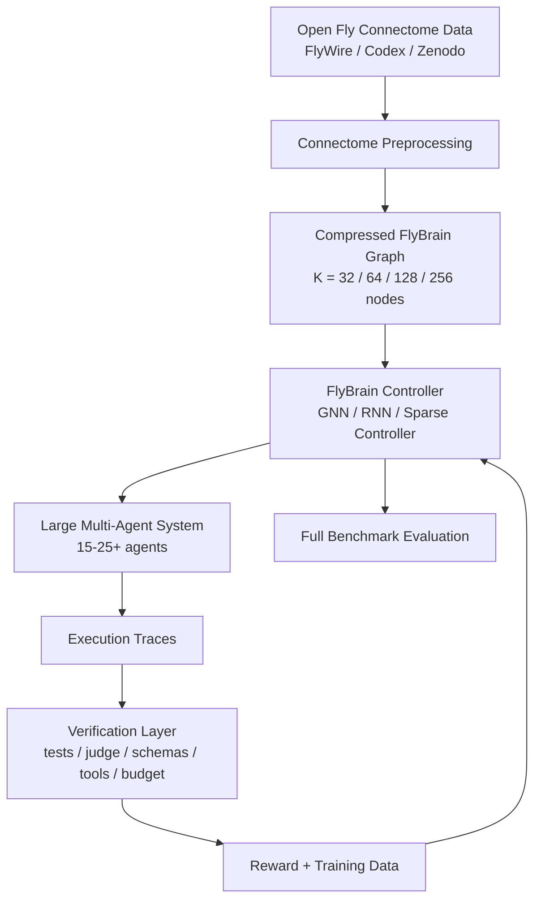
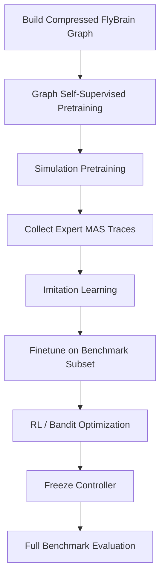

# FlyBrain Optimizer

<p align="center">
  
  
  
  
  
</p>

> **Phase 0 + Phase 1 status (this PR / branch).**
>
> *Phase 0 (Bootstrap)* is open as a separate PR: cargo workspace
> (`flybrain-core`, `flybrain-graph`, `flybrain-runtime`, `flybrain-verify`,
> `flybrain-py`, `flybrain-cli`) + Python `flybrain` package + Yandex AI
> Studio LLM client (mock + live, with SQLite cache and budget tracker) +
> Hydra configs + Dockerfile + Yandex Cloud Terraform skeleton + dual CI.
>
> *Phase 1 (Graph builder)* added: synthetic + Zenodo CSV loaders,
> five compression methods (region_agg, celltype_agg, Louvain, Leiden,
> Spectral) — all deterministic for `(graph, K, seed)`, gzip+JSON `.fbg`
> binary format with companion node-metadata JSON, builder orchestrator,
> PyO3 bindings, `flybrain build` / `flybrain-py build` CLIs, and
> `notebooks/01_explore_connectome.ipynb`. See
> [`docs/graph_pipeline.md`](docs/graph_pipeline.md) for the runbook.
>
> *Phase 2 (MAS runtime + agents)* lands here: Rust `flybrain-runtime`
> (`MessageBus`, `Scheduler`, `TraceWriter` with 14 unit tests + PyO3
> bindings); Python `flybrain.runtime` (`Agent`, `MAS.run`, episodic +
> vector memory, BM25 retriever, four deterministic tools);
> `flybrain.controller` (`Manual`, `Random`); `flybrain.agents.specs`
> with 15 minimal + 10 extended `AgentSpec`s wired to
> `configs/llm/yandex.yaml::agent_to_model`; integration test running
> three task types end-to-end on the mock LLM. See
> [`docs/runtime.md`](docs/runtime.md) for the runbook.
>
> *Phase 3 (verification layer)* lands here: Rust `flybrain-verify`
> grows `schema`, `tool_use`, `trace`, `unit_test` verifiers (24 unit
> tests) on top of the existing `budget` verifier; PyO3 surface
> exposes them as `schema_check` / `tool_use_check` / `trace_check` /
> `unit_test_check`. Python `flybrain.verification` adds the
> `FactualJudge` and `ReasoningJudge` LLM judges, and a
> `VerificationPipeline` that dispatches per `task_type`. The runner
> (`MAS.run`) now merges a cheap rule-based component check with the
> full pipeline on every `call_verifier` and at the end of each task,
> so every controller (Phase-2 manual, Phase-5 GNN/RNN) gets a real
> `VerificationResult` instead of a placeholder. See
> [`docs/verification.md`](docs/verification.md) for the runbook.
>
> The full implementation roadmap (12 phases, 48–56 days) is in
> [`PLAN.md`](PLAN.md). Operator runbooks live in [`docs/`](docs/) — see
> [`docs/architecture.md`](docs/architecture.md),
> [`docs/data_contracts.md`](docs/data_contracts.md),
> [`docs/graph_pipeline.md`](docs/graph_pipeline.md),
> [`docs/runtime.md`](docs/runtime.md),
> [`docs/verification.md`](docs/verification.md),
> [`docs/rust_python_boundary.md`](docs/rust_python_boundary.md), and
> [`docs/yandex_setup.md`](docs/yandex_setup.md).
>
> Quick start: `make setup && make test`. To produce the four canonical
> compressed graphs: `flybrain build --all`. The text below is the
> original research test specification.

## 1. Кратко

**FlyBrain Optimizer** — исследовательское тестовое задание: нужно построить универсальный оптимизатор графа большой LLM-based мультиагентной системы, используя открытые данные connectome мозга Drosophila как структурный prior.

Идея не в том, чтобы «сделать AGI из мозга мухи».  
Идея в том, чтобы превратить открытый connectome мухи в маленький обучаемый контроллер, который управляет большой системой агентов:

- выбирает, каких агентов запускать;
- решает, кто кому передает сообщения;
- добавляет, удаляет, усиливает или ослабляет связи в agent graph;
- решает, когда вызывать tools, memory, retrieval и verifier;
- учится снижать стоимость, latency и число лишних LLM-вызовов;
- после обучения проверяется на полном наборе benchmark’ов.

---

## 2. На чем основана идея

Открытый FlyWire connectome взрослой Drosophila содержит **139,255 нейронов** и **54.5 млн синаптических связей**. Это не готовая языковая модель, а карта связей мозга, которую можно использовать как графовый prior для контроллера.

Полезные источники:

| Ресурс | Что там есть |
|---|---|
| [FlyWire](https://flywire.ai/) | Whole-brain connectome взрослой Drosophila |
| [Codex: Connectome Data Explorer](https://codex.flywire.ai/) | Веб-интерфейс для поиска, анализа и экспорта connectome-данных |
| [Nature: Neuronal wiring diagram of an adult brain](https://www.nature.com/articles/s41586-024-07558-y) | Основная публикация про полный connectome взрослой мухи |
| [FlyWire connectivity data on Zenodo](https://zenodo.org/records/10676866) | Публичный релиз connectivity data |
| [FlyGym / NeuroMechFly](https://github.com/NeLy-EPFL/flygym) | Опциональная embodied-среда для симуляции Drosophila |

---

## 3. Главная гипотеза

> Connectome мозга мухи может быть полезным структурным prior’ом для оптимизации графа большой мультиагентной системы.

Проверяемый вопрос:

> Может ли FlyBrain Optimizer после pretraining/finetuning/RL давать лучшее соотношение quality/cost, чем manual graph, random graph, fully connected graph и обычный learned router без fly-prior?

---

## 4. Общая схема



---

## 5. Что нужно сделать

Нужно реализовать **универсальный FlyBrain Optimizer** для большой MAS.

Система должна состоять из трех основных частей:

1. **FlyBrain Graph Builder**  
   Загружает или получает открытые connectome-данные, сжимает их в компактный directed weighted graph.

2. **Large Multi-Agent Runtime**  
   Запускает большую систему из 15–25+ агентов с динамическим графом взаимодействий.

3. **FlyBrain Controller**  
   Получает состояние выполнения MAS и предсказывает следующую graph-action: кого вызвать, какую связь добавить, когда вызвать verifier, когда остановиться.

---

## 6. Большая мультиагентная система

Минимум: **15 агентов**.  
Желательно: **20–25+ агентов**.

Пример набора агентов:

```text
Planner
Task Decomposer
Researcher
Retriever
Memory Reader
Memory Writer
Coder
Debugger
Test Runner
Critic
Verifier
Refiner
Judge
Tool Executor
Math Solver
Search Agent
Constraint Checker
Finalizer
Failure Recovery Agent
Budget Controller
Context Compressor
Citation Checker
Schema Validator
```

Каждый агент должен иметь описание:

```python
class AgentSpec:
    name: str
    role: str
    system_prompt: str
    tools: list[str]
    input_schema: dict
    output_schema: dict
    cost_weight: float
```

Runtime должен логировать:

```text
active_agent
input_message
output_summary
tool_calls
errors
token_usage
latency
verifier_score
current_graph
graph_action
```

---

## 7. Как из connectome сделать контроллер

Полный connectome слишком большой, поэтому его нужно сжать.

### 7.1. Входные данные

Можно использовать:

- FlyWire/Codex export;
- Zenodo connectivity tables;
- заранее подготовленный subgraph;
- агрегированный graph по brain regions / cell types;
- synthetic fly-inspired graph, если реальный export не успели поднять, но нужно честно описать ограничение.

### 7.2. Сжатие графа

Нужно получить компактный граф:

```text
K = 32 / 64 / 128 / 256 nodes
directed weighted adjacency matrix
node features
edge weights
optional excitatory/inhibitory signs
```

Возможные способы compression:

1. **Region-level aggregation**  
   Нейроны агрегируются в brain regions / функциональные блоки.

2. **Cell-type aggregation**  
   Нейроны агрегируются по cell type.

3. **Graph clustering**  
   Использовать Louvain / Leiden / spectral clustering / METIS.

4. **Graph embedding + clustering**  
   Сначала получить node embeddings, потом кластеризовать.

5. **Subgraph extraction**  
   Взять только подграф, связанный с memory/planning/action-like областями.

Выходные файлы:

```text
data/flybrain/fly_graph_64.pt
data/flybrain/fly_graph_128.pt
data/flybrain/node_metadata.json
data/flybrain/edge_metadata.json
```

---

## 8. FlyBrain Controller

Контроллер получает состояние MAS и выдает graph-action.

### Input

```text
task_embedding
current_agent_graph
agent_states
previous_outputs_embeddings
tool_errors
verifier_score
token_budget
latency_so_far
step_number
```

### Output actions

```text
activate_agent(agent_i)
add_edge(agent_i, agent_j)
remove_edge(agent_i, agent_j)
increase_edge_weight(agent_i, agent_j)
decrease_edge_weight(agent_i, agent_j)
call_memory()
call_retriever()
call_tool_executor()
call_verifier()
terminate()
```

### Допустимые архитектуры

#### Вариант A: Connectome-GNN

```text
MAS state + task embedding
    -> message passing over compressed fly graph
    -> action decoder
    -> graph mutation
```

#### Вариант B: Connectome-RNN

```text
h_t = activation(A_fly @ h_{t-1} + W_x @ x_t)
action_logits = W_out @ h_t
```

Где `A_fly` — sparse adjacency matrix, полученная из fly connectome.

#### Вариант C: Learned Router + Fly Regularizer

```text
loss = task_loss + cost_penalty + lambda * graph_distance(learned_graph, fly_prior_graph)
```

---

## 9. Embeddings

Embeddings нужны, чтобы controller видел не только названия агентов, но и смысл задачи, состояние trace и текущее поведение MAS.

### 9.1. Task Embedding

Кодирует входную задачу.

Примеры:

```text
"написать функцию"
"найти ошибку в коде"
"решить математическую задачу"
"сделать research summary"
"использовать tool и проверить результат"
```

Можно использовать:

- sentence-transformer;
- OpenAI-compatible embedding model;
- локальную embedding-модель;
- усреднение hidden states маленькой LLM;
- простые TF-IDF/BoW как baseline.

### 9.2. Agent Embedding

Кодирует роль агента:

```text
Planner -> planning/decomposition
Coder -> code generation
Verifier -> checking/testing
Retriever -> information lookup
Memory -> previous context access
```

Agent embedding можно строить из:

```text
role description
system prompt
available tools
past success statistics
cost profile
```

### 9.3. Trace Embedding

Кодирует историю выполнения:

```text
какие агенты уже работали
что они сделали
какие ошибки возникли
что сказал verifier
какие tools были вызваны
```

Trace embedding нужен, чтобы controller понимал, нужно ли продолжать, чинить ошибку, вызвать critic или остановиться.

### 9.4. Graph Embedding

Кодирует текущий agent graph:

```text
node states
edge weights
graph density
active path
agent utilization
```

Можно использовать:

- GNN over current agent graph;
- graph pooling;
- degree features;
- edge statistics;
- node2vec / DeepWalk как baseline;
- handcrafted graph features.

### 9.5. Fly Connectome Embedding

Кодирует compressed fly graph.

Варианты:

```text
node2vec over fly graph
GraphSAGE / GCN pretraining
spectral embeddings
random walk embeddings
region/cell-type metadata embeddings
```

Эти embeddings можно использовать как:

```text
initial node features
routing prior
regularization target
controller hidden topology
```

---

## 10. Verification Layer

Verification — обязательная часть задания.  
Именно verifier превращает MAS execution в обучающий сигнал для FlyBrain Optimizer.

Verifier должен не просто сказать “ответ хороший”, а вернуть структурированный результат:

```python
class VerificationResult:
    passed: bool
    score: float
    errors: list[str]
    warnings: list[str]
    failed_component: str | None
    suggested_next_agent: str | None
    reward_delta: float
```

### 10.1. Виды верификации

#### 1. Unit-test verification

Для coding tasks:

```text
запустить unit tests
проверить pass/fail
собрать traceback
передать ошибку Debugger/Coder
```

#### 2. Schema verification

Проверяет, что agent output соответствует нужной структуре.

Пример:

```text
JSON валиден
есть обязательные поля
нет запрещенных полей
тип данных корректный
```

#### 3. Tool-use verification

Проверяет, что tool был вызван корректно:

```text
команда завершилась без ошибки
API вернул валидный ответ
поиск дал релевантные источники
python-код выполнился
```

#### 4. Factual verification

Для research tasks:

```text
есть ссылки на источники
источники релевантны
нет противоречий между ответом и источником
```

#### 5. Reasoning verification

Для math/reasoning tasks:

```text
финальный ответ совпадает с эталоном
решение не противоречит условию
intermediate steps не содержат явной ошибки
```

#### 6. Budget verification

Проверяет эффективность:

```text
не превышен token budget
не превышен max calls
не превышена latency
не слишком плотный graph
```

#### 7. Trace verification

Проверяет само поведение MAS:

```text
не было бесконечных циклов
не было лишнего многократного вызова одного агента
critic реально повлиял на исправление
verifier вызван до final answer
```

---

## 11. Как verification используется в обучении

Verification layer дает:

1. **final reward**;
2. **step-level reward**;
3. **labels для imitation learning**;
4. **failure signals для recovery policy**;
5. **negative examples**.

Пример:

```text
Verifier: tests failed
Failed component: edge case in code
Suggested next agent: Debugger
Reward delta: -0.4
```

Controller должен научиться:

```text
после failed tests вызывать Debugger
после factual uncertainty вызывать Retriever
после schema error вызывать Schema Validator
после high verifier score завершать выполнение
```

---

## 12. Как обучать “мозг мухи”

Важно: биологический мозг не обучается напрямую.  
Обучается искусственный controller, построенный на структуре connectome.

Допустимые режимы обучения:

---

### 12.1. Simulation Pretraining

Сначала создать дешевую симуляцию MAS без реальных LLM-вызовов.

В симуляции:

```text
каждый task type имеет оптимальный маршрут
каждый agent имеет вероятность успеха
лишние agents дают cost penalty
verifier возвращает synthetic score
tool errors генерируются искусственно
```

Пример:

```text
coding task:
  optimal route = Planner -> Coder -> Test Runner -> Debugger -> Verifier

research task:
  optimal route = Planner -> Researcher -> Retriever -> Citation Checker -> Finalizer

math task:
  optimal route = Planner -> Math Solver -> Critic -> Verifier
```

Цель:

```text
научить controller базовой routing-логике дешево
```

---

### 12.2. Imitation Learning from Expert Traces

Запустить сильный ручной MAS или дорогой fully-connected MAS.  
Собрать execution traces.  
Обучить FlyBrain Controller имитировать хорошие routing decisions.

```text
expert trace -> state/action pairs -> supervised training
```

Пример labels:

```text
state_t -> activate_agent(Debugger)
state_t -> call_verifier()
state_t -> terminate()
state_t -> add_edge(Critic, Coder)
```

---

### 12.3. Reinforcement Learning

После simulation/imitation можно дообучить controller через RL.

Reward:

```python
reward = (
    success_score
    + 0.5 * verifier_score
    - alpha * total_tokens
    - beta * llm_calls
    - gamma * latency
    - delta * failed_tool_calls
    - eta * graph_density
)
```

Подходящие алгоритмы:

```text
Contextual Bandit
REINFORCE
DQN
PPO
Actor-Critic
GRPO-style optimization
```

Для тестового достаточно contextual bandit или simple PPO.

---

### 12.4. Offline RL from Traces

Если реальные LLM-вызовы дорогие, можно обучаться на сохраненных traces.

```text
stored traces -> state/action/reward tuples -> offline policy optimization
```

Это хороший вариант для экономии бюджета.

---

### 12.5. Graph Self-Supervised Pretraining

Можно предварительно обучить connectome encoder на самом fly graph.

Задачи:

```text
link prediction
edge weight prediction
masked node prediction
node type prediction
random walk context prediction
```

После этого веса graph encoder используются в FlyBrain Controller.

---

### 12.6. Optional: FlyGym / NeuroMechFly Simulation

Дополнительная hard-mode идея: использовать FlyGym / NeuroMechFly для embodied pretraining.

Возможная схема:

```text
fly connectome graph
    -> embodied navigation/control simulation
    -> pretrain controller dynamics
    -> transfer compressed controller to MAS routing
```

Это необязательно. Основная задача — не locomotion, а optimization of multi-agent graph.

---

## 13. Training Schedule



Рекомендуемый порядок:

1. Build FlyBrain graph.
2. Pretrain graph encoder на link prediction / node prediction.
3. Pretrain routing на симуляции.
4. Собрать traces от manual/strong MAS.
5. Imitation learning.
6. Finetune на 10–20% benchmark’ов.
7. RL/bandit optimization.
8. Freeze controller.
9. Прогон на полном benchmark suite.

---

## 14. Benchmarks

Finetune делается только на части задач.  
Full evaluation делается на всем наборе.

Рекомендуемые benchmark-классы:

```text
HumanEval / MBPP          -> coding
GSM8K / MATH              -> math reasoning
BBH                       -> complex reasoning
MMLU-Pro subset           -> knowledge/reasoning
tool-use tasks            -> tools/search/python
repo-fixing tasks         -> agentic coding
synthetic routing tasks   -> cheap pretraining
```

---

## 15. Baselines

Обязательно сравнить:

```text
1. Manual MAS graph
2. Fully connected MAS
3. Random sparse graph
4. Degree-preserving random graph
5. Learned router without fly prior
6. FlyBrain prior without training
7. FlyBrain + simulation pretraining
8. FlyBrain + imitation learning
9. FlyBrain + RL / bandit finetuning
```

Главное сравнение:

```text
Manual MAS
vs Learned Router
vs FlyBrain Prior
vs FlyBrain + Finetune
vs FlyBrain + RL
```

---

## 16. Metrics

Нужно мерить не только качество, но и стоимость.

Обязательные метрики:

```text
accuracy / pass@1 / task success
verifier pass rate
total tokens
LLM calls
latency
cost per solved task
failed tool calls
average graph size
average execution steps
number of recovery loops
```

Дополнительные метрики:

```text
agent utilization
edge importance
graph density
budget violations
failure recovery success
performance under strict budget
generalization from finetune subset to full benchmark
```

---

## 17. Главная таблица результатов

```text
| Method                     | Success | Verifier Pass | Tokens | Calls | Latency | Cost/Solved |
|----------------------------|---------|---------------|--------|-------|---------|-------------|
| Manual MAS                 |         |               |        |       |         |             |
| Fully Connected MAS        |         |               |        |       |         |             |
| Random Sparse              |         |               |        |       |         |             |
| Learned Router             |         |               |        |       |         |             |
| FlyBrain Prior             |         |               |        |       |         |             |
| FlyBrain + Simulation      |         |               |        |       |         |             |
| FlyBrain + Imitation       |         |               |        |       |         |             |
| FlyBrain + RL              |         |               |        |       |         |             |
```

---

## 18. Обязательные experiments

### Experiment 1: Static graph comparison

```text
manual graph
fully connected graph
random sparse graph
flybrain prior graph
```

### Experiment 2: Embedding ablation

Сравнить controller с embeddings и без:

```text
no embeddings
task embeddings only
task + agent embeddings
task + agent + trace embeddings
task + agent + trace + graph embeddings
```

### Experiment 3: Verification ablation

Сравнить:

```text
no verifier
final verifier only
step-level verifier
full verification layer
```

### Experiment 4: Training ablation

Сравнить:

```text
FlyBrain prior only
+ graph self-supervised pretraining
+ simulation pretraining
+ imitation learning
+ RL finetuning
```

### Experiment 5: Full benchmark generalization

```text
finetune на 10-20% задач
freeze controller
evaluate на полном benchmark suite
```
---

## 19. Minimal Deliverables

Решение должно содержать:

```text
1. Fly connectome graph builder или честно описанный flybrain-inspired graph builder
2. Сжатый FlyBrain graph
3. Большую MAS минимум из 15 агентов
4. Dynamic graph runtime
5. FlyBrain Controller
6. Embedding layer для task/agent/trace/graph states
7. Verification layer
8. Training loop
9. Evaluation loop
10. Baselines
11. Таблицу результатов
12. 2-3 execution traces
13. Краткий research report
```

---
## 20. Замечания
```text
1. Можно изменять написанный план если идеи действительно стоят того и улучшат задачу
2. Разрешенные языки для ядра - Python, Rust
3. Любые улучшения приветсвуются
```
